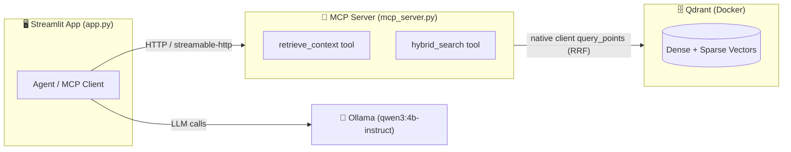

# 📚 Lab: Building an Agentic RAG System with MCP Tools

Welcome to the **Agentic RAG + Model Context Protocol (MCP) Lab**! In this lab, you will build a local, privacy-first AI application where the retrieval tools live inside a **standalone MCP server** that you run locally and expose over **HTTP**. Your agent will connect to that server as an **MCP client** and call the tools remotely.

This is how production agent systems are built: tools are decoupled from the agent, run as independent services, and are reusable across many agents and frameworks.

Unlike a monolithic RAG script, this **MCP-based Agentic RAG** system separates concerns:
- 🧰 **MCP Server**: Hosts the retrieval tools (document search, hybrid search) as MCP tools.
- 🌐 **HTTP Transport**: The server is exposed over `streamable-http` so any client can call it.
- 🤖 **MCP Client + Agent**: A ReAct-style agent discovers the tools over HTTP and calls them.

We will be using a powerful modern AI stack:

- **Ollama**: To run the qwen3:4b-instruct Large Language Model locally.
- **Docker & Qdrant**: To host our Vector Database natively for fast, scalable document retrieval.
- **FastEmbed**: To generate highly accurate embeddings using Jina embeddings.
- **MCP (Model Context Protocol)**: To expose retrieval tools as a reusable, language-agnostic server.
- **FastMCP**: The high-level server API bundled in the MCP Python SDK (`mcp.server.fastmcp`).
- **langchain-mcp-adapters**: To let a LangChain agent consume MCP tools over HTTP.
- **LangChain Agentic RAG**: Using `create_agent` (2026 syntax) with MCP-loaded tools.
- **LangGraph**: For agent orchestration with streaming support.
- **uv**: For lightning-fast Python project and dependency management.
- **Streamlit**: To build a beautiful, interactive web user interface.

**Important architectural rules for this lab:**
- The retrieval tools **must** live in a separate MCP server process (`mcp_server.py`).
- The server **must** be exposed over **HTTP** (`streamable-http`), not stdio.
- The agent **must** connect to the server as an HTTP MCP client — it must NOT import the retrieval functions directly.
- We will use **native Qdrant client** (NOT langchain-qdrant) for collection creation, points insertion, and hybrid search with RRF fusion.

---

## 🏗️ Architecture Overview



The agent never touches Qdrant directly. It only knows about **MCP tools** reached over **HTTP**.

---

## 🛠️ Task 1: Prerequisites & Repository Setup

Before we start coding, let's set up our workspace.

1. Ensure you have Git installed on your machine.
2. Clone this repository to your local machine:
   ```bash
   git clone <YOUR_REPO_URL_HERE>
   cd <REPO_NAME>
   ```
3. Create a folder named `documents` to temporarily store your test PDF files.

---

## 🐳 Task 2: Install & Verify Docker

We need Docker to run our Qdrant vector database in an isolated container.

🔗 Reference: [Docker Official Installation Guide](https://docs.docker.com/get-docker/)

1. Download and install Docker Desktop for your operating system.
2. Open your terminal and verify the installation:
   ```bash
   docker --version
   ```

---

## 🗄️ Task 3: Set up Qdrant Vector Database

Qdrant is a high-performance vector search engine. We will run it locally using Docker.

🔗 Reference: [Qdrant Quickstart Documentation](https://qdrant.tech/documentation/quickstart/)

1. Open your terminal and pull the Qdrant Docker image:
   ```bash
   docker pull qdrant/qdrant
   ```

2. Run the Qdrant container, exposing the necessary ports:

   **Mac/Linux (bash):**
   ```bash
   docker run -p 6333:6333 -p 6334:6334 \
       -v $(pwd)/qdrant_storage:/qdrant/storage:z \
       qdrant/qdrant
   ```

   **Windows (PowerShell):**
   ```powershell
   docker run -p 6333:6333 -p 6334:6334 `
       -v "${PWD}/qdrant_storage:/qdrant/storage:z" `
       qdrant/qdrant
   ```

   **Windows (cmd):**
   ```cmd
   docker run -p 6333:6333 -p 6334:6334 -v "%cd%/qdrant_storage:/qdrant/storage:z" qdrant/qdrant
   ```

3. Verify it is running at [http://localhost:6333/dashboard](http://localhost:6333/dashboard).

---

## 🦙 Task 4: Install & Configure Ollama

Ollama allows us to run large language models locally.

🔗 Reference: [Ollama Download Page](https://ollama.com/download)

1. Download and install Ollama for your OS.
2. Verify the installation:
   ```bash
   ollama --version
   ```

---

## 🧠 Task 5: Download the Qwen3 4B Instruct Model

1. Download the model:
   ```bash
   ollama run qwen3:4b-instruct
   ```
2. Type "Hello" to test, then `/bye` to exit.

---

## 🐍 Task 6: Python Environment & Dependencies

We will use **uv** for Python project management.

🔗 Reference: [uv Official Documentation](https://docs.astral.sh/uv/)

1. **Install uv**:
   - **Mac/Linux:** `curl -LsSf https://astral.sh/uv/install.sh | sh`
   - **Windows:** `powershell -ExecutionPolicy ByPass -c "irm https://astral.sh/uv/install.ps1 | iex"`

2. **Initialize the project**:
   ```bash
   uv init
   ```

3. **Rename** `hello.py` to `app.py`.

4. **Add dependencies** (2026 versions). Note the new **MCP** packages:
   ```bash
   uv add streamlit "qdrant-client[fastembed]" fastembed pymupdf4llm langchain-pymupdf4llm langchain-text-splitters langchain-ollama langchain "langchain-core>=1.0" langgraph "mcp[cli]" langchain-mcp-adapters
   ```

   > **Note**: We use **native qdrant-client** (NOT langchain-qdrant) for collection management and hybrid search. The new pieces are:
   > - **`mcp[cli]`** → build & run the MCP server. It bundles **FastMCP** (`from mcp.server.fastmcp import FastMCP`) and the `mcp` CLI (`mcp dev`). You do **not** need the separate `fastmcp` package.
   > - **`langchain-mcp-adapters`** → let the agent consume MCP tools over HTTP.

---

## 📄 Task 7: Document Loading & Text Splitting

Create a shared module `rag_core.py`. This module holds the pure RAG logic (no agent, no MCP) so both the MCP server and the ingestion step can reuse it.

**Your Task:** Fill in the blanks to create the document loading function:

```python
# rag_core.py
from langchain_pymupdf4llm import PyMuPDF4LLMLoader
from langchain_text_splitters import MarkdownTextSplitter

def load_and_split_pdf(file_path):
    # TODO: Initialize PyMuPDF4LLMLoader with the given file path
    loader = PyMuPDF4LLMLoader(file_path=___)

    # TODO: Load the document
    docs = loader.___()

    # TODO: Initialize MarkdownTextSplitter with appropriate chunk settings
    splitter = MarkdownTextSplitter(chunk_size=___, chunk_overlap=___)

    # TODO: Split the documents into chunks
    chunks = splitter.split_documents(___)

    return chunks
```

---

## 🧩 Task 8: Native Qdrant Setup — Collection Creation & Points Insertion

**Your Task:** In `rag_core.py`, connect to Qdrant using the **native client**, create a collection with explicit vector configs, and upload points using `upload_points`:

```python
# rag_core.py (continued)
from qdrant_client import QdrantClient, models
from fastembed import TextEmbedding, SparseTextEmbedding
import uuid

QDRANT_URL = "http://localhost:6333"
DENSE_MODEL = "jinaai/jina-embeddings-v2-base-en"
SPARSE_MODEL = "Qdrant/bm25"

def setup_qdrant_collection(chunks, collection_name="documents"):
    """Setup Qdrant collection using native client with dense + sparse vectors."""
    # TODO: Initialize Native Qdrant Client
    client = QdrantClient(url=___)

    # TODO: Initialize embedding models (FastEmbed)
    dense_embedder = TextEmbedding(model_name=___)
    sparse_embedder = SparseTextEmbedding(model_name=___)

    # Get embedding dimensions by encoding a sample text
    sample_embedding = list(dense_embedder.embed(["sample text"]))[0]
    vector_size = len(sample_embedding)

    # TODO: Create collection if it doesn't exist
    if not client.collection_exists(collection_name=___):
        client.create_collection(
            collection_name=___,
            vectors_config={
                "dense": models.VectorParams(
                    size=___,
                    distance=models.Distance.COSINE
                )
            },
            sparse_vectors_config={
                "sparse": models.SparseVectorParams(
                    index=models.SparseIndexParams(on_disk=False)
                )
            }
        )

    # TODO: Prepare points for upload with dense + sparse vectors
    points = []
    texts = [chunk.page_content for chunk in ___]

    dense_vectors = list(dense_embedder.embed(texts))
    sparse_vectors = list(sparse_embedder.embed(texts))

    for idx, (chunk, dense_vec, sparse_vec) in enumerate(zip(chunks, dense_vectors, sparse_vectors)):
        sparse_indices = sparse_vec.indices.tolist()
        sparse_values = sparse_vec.values.tolist()

        point = models.PointStruct(
            id=str(uuid.uuid4()),
            vector={
                "dense": dense_vec.tolist() if hasattr(dense_vec, 'tolist') else list(dense_vec),
                "sparse": models.SparseVector(
                    indices=sparse_indices,
                    values=sparse_values
                )
            },
            payload={
                "page_content": chunk.page_content,
                "metadata": chunk.metadata,
                "chunk_id": idx
            }
        )
        points.append(point)

    # TODO: Upload points using native upload_points (with parallelization)
    client.upload_points(
        collection_name=___,
        points=___,
        batch_size=___,      # e.g., 64
        parallel=___,        # e.g., 2 workers
        max_retries=___,     # e.g., 3
        wait=False
    )

    return collection_name
```

> 💡 **Design note:** The MCP server should be able to recreate the embedders on its own from `DENSE_MODEL` / `SPARSE_MODEL`, so we no longer return the embedder objects across process boundaries. Tools are stateless and reconnect to Qdrant by URL.

---

## 🔍 Task 9: Native Hybrid Search with RRF Fusion

**Your Task:** In `rag_core.py`, implement hybrid search using native Qdrant `prefetch` + `FusionQuery`. This is the function the MCP tool will wrap:

```python
# rag_core.py (continued)
def hybrid_search_rrf(query_text, collection_name="documents", limit=5,
                      client=None, dense_embedder=None, sparse_embedder=None):
    """Perform hybrid search using dense + sparse vectors with RRF fusion."""
    # Lazily build connections/embedders so the MCP tool can call this statelessly
    client = client or QdrantClient(url=QDRANT_URL)
    dense_embedder = dense_embedder or TextEmbedding(model_name=DENSE_MODEL)
    sparse_embedder = sparse_embedder or SparseTextEmbedding(model_name=SPARSE_MODEL)

    # TODO: Generate embeddings for the query
    dense_query = list(dense_embedder.embed([___]))[0]
    sparse_query = list(sparse_embedder.embed([___]))[0]

    sparse_indices = sparse_query.indices.tolist()
    sparse_values = sparse_query.values.tolist()

    # TODO: Perform hybrid search with RRF fusion using prefetch
    results = client.query_points(
        collection_name=___,
        prefetch=[
            models.Prefetch(
                query=models.SparseVector(indices=sparse_indices, values=sparse_values),
                using="sparse",
                limit=20
            ),
            models.Prefetch(
                query=dense_query.tolist() if hasattr(dense_query, 'tolist') else list(dense_query),
                using="dense",
                limit=20
            )
        ],
        query=models.FusionQuery(fusion=models.Fusion.RRF),
        with_payload=True,
        limit=___
    )

    # TODO: Extract and return the documents
    documents = []
    for point in results.points:
        documents.append({
            "content": point.payload["page_content"],
            "metadata": point.payload["metadata"],
            "score": point.score,
            "id": point.id
        })

    return documents
```

---

## 🧰 Task 10: Build the MCP Server (Tools over HTTP)

This is the heart of the new lab. You will expose your retrieval logic as **MCP tools** inside a dedicated server process, served over **HTTP** using `streamable-http`.

**Your Task:** Create `mcp_server.py` and register the retrieval tool with **FastMCP**.

```python
# mcp_server.py
from mcp.server.fastmcp import FastMCP
from rag_core import hybrid_search_rrf

# TODO: Create the MCP server instance and give it a name
mcp = FastMCP(___)  # e.g., "rag-tools"

# TODO: Register the retrieval tool with the @mcp.tool() decorator.
# The docstring + type hints become the tool schema the agent sees.
@mcp.tool()
def retrieve_context(query: str, limit: int = 5) -> str:
    """Retrieve relevant documents from the knowledge base using hybrid
    search (dense + sparse) with RRF fusion.

    Args:
        query: The natural-language search query.
        limit: Maximum number of chunks to return.
    """
    # TODO: Call your hybrid search function from rag_core
    docs = hybrid_search_rrf(query_text=___, limit=___)

    # TODO: Format the retrieved documents into a single string for the LLM
    if not docs:
        return "No relevant documents found."

    serialized = "\n\n".join(
        f"Source: {doc['metadata']}\nScore: {doc['score']:.4f}\nContent: {doc['content']}"
        for doc in docs
    )
    return serialized


# TODO (optional): add a second tool, e.g. a health/info tool
@mcp.tool()
def server_info() -> str:
    """Return basic info about the RAG MCP server."""
    return "RAG MCP server is running. Tool: retrieve_context (hybrid RRF search)."


if __name__ == "__main__":
    # TODO: Run the server over HTTP using the streamable-http transport.
    # FastMCP serves on http://127.0.0.1:8000/mcp by default.
    mcp.run(transport=___)  # e.g., "streamable-http"
```

**Run the MCP server in its own terminal:**

```bash
uv run python mcp_server.py
```

You should see it listening on `http://127.0.0.1:8000/mcp`. Keep this terminal open — it is a long-running service.

> 🔎 **Why HTTP and not stdio?** HTTP (`streamable-http`) lets the tools run as an independent network service that any client — your Streamlit app, a different agent, even a different language — can call. This is the realistic, production-style topology.

---

## 🔬 Task 11: Test the MCP Server with the MCP Inspector

**Before** wiring up the agent, verify your MCP server works in isolation using the **MCP Inspector** — an official browser-based debugging UI for MCP servers. This lets you list tools, inspect their schemas, and call them manually so you can confirm the server is correct *independently* of the agent and the LLM.

🔗 Reference: [MCP Inspector](https://github.com/modelcontextprotocol/inspector)

### Prerequisites
- Node.js installed (`node --version`). The Inspector runs via `npx`, so no global install is required.
- `mcp[cli]` installed (Task 6) — this gives you the `mcp` CLI, including `mcp dev`.
- **Qdrant populated** (do Task 12 first if you want `retrieve_context` to return real chunks — otherwise it will simply return "No relevant documents found.").

### Launch with `mcp dev` — server *and* Inspector together

The MCP Python SDK bundles a one-command workflow that spins up your server and opens the Inspector wired to it automatically. You do **not** need a separate `mcp_server.py` terminal for this — `mcp dev` runs the server for you:

```bash
uv run mcp dev mcp_server.py
```

This launches the Inspector (downloading it via `npx` on first run) and prints a local URL with a pre-filled auth token, e.g.:
```
🔗 Open inspector with token pre-filled:
   http://localhost:6274/?MCP_PROXY_AUTH_TOKEN=...
```
Open that URL — the Inspector is already connected to your server. Continue with **List the tools** below.

> 💡 `mcp dev` runs your `FastMCP` object over a dev transport for inspection, so it works regardless of the `transport=` you set in `__main__`. It is the fastest way to iterate on tools.

### Steps

Once the Inspector is connected to your server:

1. **List the tools:** Open the **Tools** tab and click **List Tools**. You should see:
   - `retrieve_context` (with `query: string`, `limit: int` parameters)
   - `server_info`

   Confirm the parameter names, types, and descriptions match what you defined with `@mcp.tool()`. This is exactly the schema your agent will discover over HTTP.

2. **Call a tool manually:**
   - Select `retrieve_context`, type a `query` (e.g., a phrase from your ingested PDF), set `limit` to `5`, and click **Run Tool**.
   - Inspect the returned text. If Qdrant is populated, you should see ranked chunks with sources and RRF scores. If it returns "No relevant documents found.", ingest a document first (Task 12).
   - Call `server_info` to confirm a simple no-argument tool also works.

3. **Watch the request/response pane:** The Inspector shows the raw MCP messages exchanged over HTTP. Use this to debug schema errors, exceptions thrown inside your tool, or transport mismatches.

> ✅ **Gate:** Do not move on to the agent until the Inspector lists your tools and `retrieve_context` returns results. If the Inspector can't reach the server, neither will the agent.

### One-line alternative (CLI mode)

You can also exercise the server headlessly from the terminal — handy for quick checks or CI. This connects to the **HTTP endpoint**, so first start the server in another terminal (`uv run python mcp_server.py`), then run:

```bash
# List tools
npx @modelcontextprotocol/inspector --cli http://127.0.0.1:8000/mcp --transport http --method tools/list

# Call the retrieval tool
npx @modelcontextprotocol/inspector --cli http://127.0.0.1:8000/mcp --transport http \
  --method tools/call --tool-name retrieve_context --tool-arg query="your question" --tool-arg limit=5
```

### Troubleshooting

| Symptom | Likely cause | Fix |
| --- | --- | --- |
| `mcp dev` fails to start | Wrong file / no server object | Run `uv run mcp dev mcp_server.py` from the project root; the file must define a top-level `mcp = FastMCP(...)` |
| Inspector page won't open | Missing auth token | Use the full printed URL including `?MCP_PROXY_AUTH_TOKEN=...` |
| Tools list is empty | `@mcp.tool()` not applied / wrong module run | Verify the decorators and that you ran the correct file |
| `retrieve_context` returns nothing | Qdrant empty | Run the ingestion step (Task 12) first |
| CLI mode: connection refused on `:8000` | HTTP server not running | Start `uv run python mcp_server.py` before using `--cli` against `http://127.0.0.1:8000/mcp` |

---

## 🌐 Task 12: Ingestion Script (Populate Qdrant)

Because tools are now stateless and remote, you need a one-time **ingestion** step that loads a PDF into Qdrant. The MCP tools will then query whatever is already stored.

**Your Task:** Create `ingest.py`:

```python
# ingest.py
import sys
from rag_core import load_and_split_pdf, setup_qdrant_collection

def ingest(file_path, collection_name="documents"):
    # TODO: Load + split the PDF
    chunks = ___(file_path)

    # TODO: Push chunks into Qdrant (native client)
    name = ___(chunks, collection_name=collection_name)

    print(f"Ingested {len(chunks)} chunks into collection '{name}'.")

if __name__ == "__main__":
    ingest(sys.argv[1])
```

Run it once per document:

```bash
uv run python ingest.py documents/your_file.pdf
```

---

## 🤖 Task 13: Create the Agent as an MCP Client (over HTTP)

Now the agent connects to the MCP server **over HTTP**, discovers the tools dynamically, and binds them — it must NOT import `hybrid_search_rrf` directly.

**Your Task:** Create `agent.py` using `langchain-mcp-adapters` + `create_agent` (2026 syntax):

```python
# agent.py
from langchain.agents import create_agent          # 2026 syntax
from langchain_mcp_adapters.client import MultiServerMCPClient
from langgraph.checkpoint.memory import InMemorySaver

MCP_URL = "http://127.0.0.1:8000/mcp"

# TODO: Configure the MCP client to reach your server over HTTP.
# In langchain-mcp-adapters the streamable-HTTP transport value is "http"
# ("streamable_http" is also accepted as an alias). The server side runs
# mcp.run(transport="streamable-http") — same transport, different spelling.
def build_mcp_client():
    return MultiServerMCPClient(
        {
            "rag": {
                "url": ___,                 # MCP_URL
                "transport": ___,           # "http"
            }
        }
    )

# TODO: Load tools from the MCP server (async) and build the agent.
async def create_rag_agent():
    client = build_mcp_client()

    # TODO: Fetch the MCP tools over HTTP — this is a network call!
    tools = await client.___()              # get_tools()

    system_prompt = """
    You are a helpful AI assistant with access to a document knowledge base
    through MCP tools served over HTTP.

    Instructions:
    - Use the retrieve_context tool when you need information from the documents.
    - The retrieval uses hybrid search (semantic + keyword) with RRF fusion.
    - Always cite your sources when using retrieved information.
    - If the retrieved context doesn't contain relevant information, say
      "I don't have enough information to answer that question".
    """

    # TODO: Create the agent with the MCP-loaded tools (2026 syntax)
    agent = create_agent(
        model=___,           # e.g., "ollama:qwen3:4b-instruct"
        tools=___,           # the tools loaded from the MCP server
        system_prompt=___,
        checkpointer=___,    # InMemorySaver()
    )

    return agent
```

> ⚠️ **Key rule:** `tools` come from `client.get_tools()` over HTTP. If you find yourself importing `hybrid_search_rrf` into the agent, you've broken the MCP boundary — go back and use the client.

---

## 🔗 Task 14: Streaming the Agent Response (2026 Recommended)

**Your Task:** Stream the agent's response using **2026 `stream_mode="values"` syntax**. Because MCP tool calls are async, the streamer is async too:

```python
# agent.py (continued)
from langchain.messages import AIMessage

async def stream_agent_response(agent, user_query, thread_id="session_001"):
    """Stream the agent response with stream_mode='values' (2026 approach)."""
    inputs = {"messages": [{"role": "user", "content": ___}]}
    config = {"configurable": {"thread_id": ___}}

    # TODO: Stream with stream_mode="values"
    async for chunk in agent.astream(
        ___,
        stream_mode=___,     # "values"
        config=___
    ):
        latest_message = chunk["messages"][-1]

        if isinstance(latest_message, AIMessage) and latest_message.content:
            yield latest_message.content
        elif hasattr(latest_message, "tool_calls") and latest_message.tool_calls:
            yield f"\n🔍 Calling MCP tool: {[tc['name'] for tc in latest_message.tool_calls]}\n"
```

---

## 🖥️ Task 15: Build the Streamlit UI (MCP Client)

The Streamlit app is now a thin **MCP client + chat UI**. It does NOT do retrieval itself — it asks the agent, which calls the MCP server over HTTP.

**Your Task:** Build `app.py`:

```python
# app.py
import asyncio
import os
import streamlit as st

from ingest import ingest
from agent import create_rag_agent, stream_agent_response

st.title(___)  # e.g., "🤖 Agentic RAG over MCP (HTTP)"

# TODO: Initialize session state for the agent
if "agent" not in st.session_state:
    st.session_state.agent = None

# --- Sidebar: upload + ingest ---
uploaded_file = st.sidebar.file_uploader(___)

if uploaded_file:
    os.makedirs("documents", exist_ok=True)
    temp_path = os.path.join("documents", uploaded_file.name)
    with open(temp_path, "wb") as f:
        f.write(uploaded_file.getbuffer())

    with st.spinner("Ingesting into Qdrant..."):
        # TODO: Run ingestion (loads PDF into Qdrant via native client)
        ___(temp_path)

    st.success("Document ingested! Make sure mcp_server.py is running.")

# --- Build the agent once (connects to the MCP server over HTTP) ---
if st.session_state.agent is None:
    with st.spinner("Connecting to MCP server over HTTP..."):
        # TODO: create_rag_agent is async — run it from Streamlit
        st.session_state.agent = asyncio.run(create_rag_agent())

# --- Chat interface ---
user_input = st.chat_input(___)

if user_input:
    st.chat_message("user").write(user_input)

    with st.chat_message("assistant"):
        response_placeholder = st.empty()
        full_response = ""

        async def run_stream():
            global full_response
            async for token in stream_agent_response(
                st.session_state.agent,
                user_input,
                thread_id="session_001"
            ):
                full_response += token
                response_placeholder.markdown(full_response + "▌")

        # TODO: Drive the async stream from Streamlit
        asyncio.run(run_stream())
        response_placeholder.markdown(full_response)
```

> 💡 If you hit event-loop issues with `asyncio.run` inside Streamlit, wrap your calls in a single helper that creates and reuses one event loop, or use `nest_asyncio`.

---

## 🚀 Run the Whole System

You now have a **multi-process** system. Run each part in its own terminal:

1. **Qdrant** (Docker) — Task 3 (must be running).
2. **Ollama** — running with `qwen3:4b-instruct` pulled.
3. **MCP server** (the HTTP tools):
   ```bash
   uv run python mcp_server.py
   ```
4. **Streamlit app** (agent + UI, MCP client):
   ```bash
   uv run streamlit run app.py
   ```

Upload a PDF in the sidebar → ask a question → watch the agent call the **MCP tool over HTTP** to retrieve context and answer.

---

## ✅ Acceptance Checklist

- [ ] Retrieval tools are defined **only** inside `mcp_server.py` (via `@mcp.tool()`).
- [ ] The MCP server runs over **HTTP** (`transport="streamable-http"`).
- [ ] The agent loads tools via `MultiServerMCPClient(...).get_tools()` over HTTP.
- [ ] The agent does **not** import `hybrid_search_rrf` directly.
- [ ] Qdrant stores **dense + sparse** vectors and search uses **RRF fusion**.
- [ ] Stopping `mcp_server.py` makes the agent's tool calls fail (proves the HTTP boundary).

---

## 🧪 Bonus Challenges

- 🔧 Add a second MCP tool (e.g., `summarize_collection` or `list_sources`) and confirm the agent discovers it automatically over HTTP.
- 🔐 Add a simple API key / header check in the MCP server and pass it from the client config.
- 🌍 Run the MCP server on a different port/host and point the agent at it — proving full decoupling.
- 🧰 Connect a **second** MCP server (e.g., a web-search tool) using the same `MultiServerMCPClient` and let the agent choose between them.

---

## 🔗 Resources

### MCP
- [Model Context Protocol — Spec](https://modelcontextprotocol.io/)
- [Python MCP SDK](https://github.com/modelcontextprotocol/python-sdk)
- [FastMCP Documentation](https://gofastmcp.com/)
- [MCP Transports (HTTP / streamable-http)](https://modelcontextprotocol.io/docs/concepts/transports)
- [langchain-mcp-adapters](https://github.com/langchain-ai/langchain-mcp-adapters)

### Qdrant & LangChain
- [Qdrant Hybrid Queries Documentation](https://qdrant.tech/documentation/search/hybrid-queries/)
- [Hybrid Search with Reranking Tutorial](https://qdrant.tech/documentation/tutorials-basics/reranking-hybrid-search/)
- [Qdrant Points Management](https://qdrant.tech/documentation/manage-data/points/)
- [LangChain Agents Documentation](https://docs.langchain.com/oss/python/langchain/agents)
- [LangChain Streaming](https://docs.langchain.com/oss/python/langchain/streaming)
- [LangGraph Overview](https://docs.langchain.com/oss/python/langgraph/overview)
- [Qdrant Python Client v1.18.0](https://pypi.org/project/qdrant-client/)
- [LangChain v1.3.9](https://pypi.org/project/langchain/)
- [LangGraph v1.2.5](https://pypi.org/project/langgraph/)
